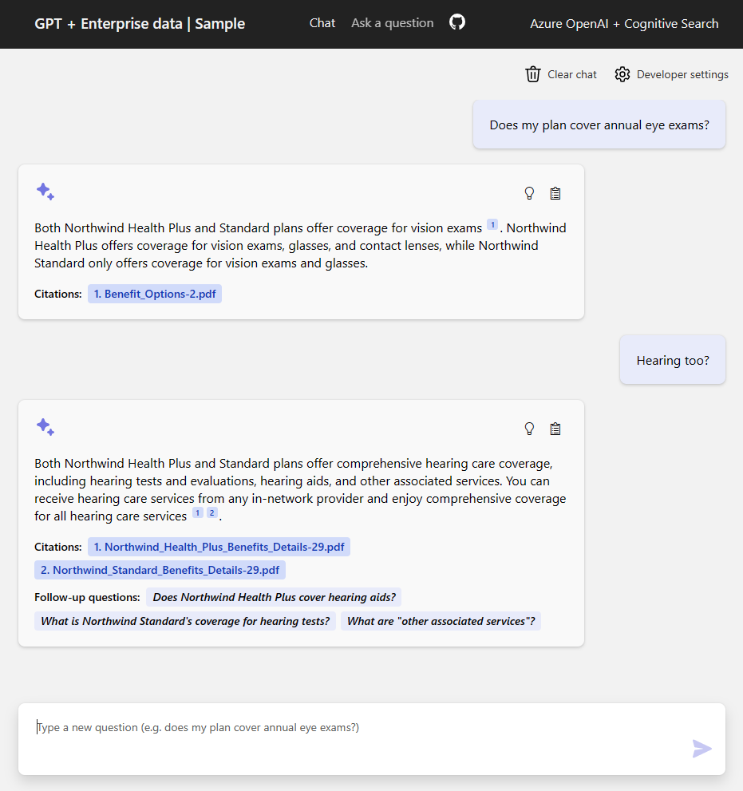

#OpenAI# ChatGPT + Enterprise data with SharePoint + Web Scraping + OpenAI with Cognitive Search

Este ejemplo demuestra algunas formas de crear experiencias similares a ChatGPT utilizando sus propios datos mediante el patrón de generación con recuperación mejorada. Utiliza Azure OpenAI Service para acceder al modelo ChatGPT (gpt-35-turbo) y Azure Cognitive Search para la indexación y recuperación de datos. Power automate para extraer y convertir Documentos y Sitio Web para convertirlos en PDF.

El repositorio no incluye ningun tipo de informacion, es necesario subir los archivos a la Storage Account y luego ejecutar ./scripts/prepdocs.ps1 para poder procesar los documentos subidos a la storage account.

## Características

* Interfaces de comunicación mediante chat y preguntas y respuestas
* Explora diversas alternativas para permitir a los usuarios evaluar la fiabilidad de las respuestas, a través de la inclusión de citas y el seguimiento de las fuentes de información.
* Presenta posibles enfoques para la preparación de datos, la construcción de comandos y la orquestación de la interacción entre el modelo ChatGPT y el recuperador Cognitive Search.
* Muestra posibles enfoques para indexar el contenido de sitios web , con el fin de integrar el contenido web con ChatGPT.
* Muestra posibles enfoques para la indexación del contenido de fuentes de SharePoint y la interacción con dicho contenido.

## Comenzando

> **IMPORTANTE**: Para la correcta ejecución y operación de esta ilustración, es necesario contar con una suscripción de Azure autorizada para utilizar el servicio Azure OpenAI. Las solicitudes de acceso a este servicio se pueden realizar a través de este enlace: https://aka.ms/oaiapply. Además, para aquellos que sean nuevos en Azure, puede resultar valioso explorar la oportunidad de adquirir créditos de Azure gratuitos para facilitar la configuración inicial, lo cual puede realizarse a través de este sitio web: https://azure.microsoft.com/free/cognitive-search/.

> **COSTOS DE RECURSOS DE AZURE**: Por defecto, este ejemplo creará recursos de Azure App Service y Azure Cognitive Search que tienen un costo mensual, así como un recurso Form Recognizer que tiene un costo por página de documento. Si desea evitar estos costos, puede cambiarlos a sus versiones gratuitas modificando el archivo de parámetros en la carpeta "infra" (aunque hay algunas limitaciones a considerar; por ejemplo, solo se puede tener un recurso gratuito de Cognitive Search por suscripción, y el recurso Form Recognizer gratuito solo analiza las primeras 2 páginas de cada documento).

### Prerequisitos

#### Ejecución Local (Instalar los siguientes componentes)
- [Azure Developer CLI](https://aka.ms/azure-dev/install)
- [Python 3+](https://www.python.org/downloads/)
    - **Importante: Para que los scripts de configuración funcionen en Windows, es necesario que Python y el administrador de paquetes pip estén en la ruta de acceso.
    - **Importante: Asegúrese de que puede ejecutar python --version desde la consola. En Ubuntu, puede ser necesario ejecutar sudo apt install python-is-python3 para enlazar python con python3.
- [Node.js](https://nodejs.org/en/download/)
- [Git](https://git-scm.com/downloads)
- [Powershell 7+ (pwsh)](https://github.com/powershell/powershell) - For Windows users only.
   - **Importante**: Asegúrese de que pueda ejecutar pwsh.exe desde un comando PowerShell. Si esto falla, probablemente necesite actualizar PowerShell.

>NOTE: NOTA: Su cuenta de Azure debe tener permisos de escritura Microsoft.Authorization/roleAssignments/write, como Administrador de acceso de usuario o Propietario/Owner.  

#### To Run in GitHub Codespaces

Puede ejecutar este repositorio de forma virtual utilizando GitHub Codespaces. Haga clic en el boton a continuación para abrir este repositorio.

### Instalación 

#### Primeros Pasos

1. Crear una nueva carpeta y posicionarse en esa
1. Ejecutar `azd login`
1. Ejecutar `azd init -t OpenAI-CognitiveSearch`
    * For the target location, the regions that currently support the models used in this sample are **East US** or **South Central US**. For an up-to-date list of regions and models, check [here](https://learn.microsoft.com/en-us/azure/cognitive-services/openai/concepts/models)

#### Iniciar desde cero:

Ejecute el siguiente comando si no tiene ningún servicio de Azure preexistente y desea comenzar con una implementación nueva.

1. Ejecute azd up - Esto aprovisionará recursos de Azure e implementará esta muestra en esos recursos, incluida la construcción del índice de búsqueda basado en los archivos PDF encontrados en la Storage Account.
1. Después de que la aplicación se haya implementado con éxito, verá una URL impresa en la consola. Haga clic en esa URL para interactuar con la aplicación en su navegador.  

Se verá de la siguiente manera:

    

> NOTA: Puede tomar un minuto para que la aplicación se implemente completamente. Si ve una pantalla de bienvenida de "Python Developer", espere un minuto y actualice la página..

#### Utilizar recursos existentes:

1. Ejecute azd env set AZURE_OPENAI_SERVICE {Nombre del servicio OpenAI existente}
2. Ejecute azd env set AZURE_OPENAI_RESOURCE_GROUP {Nombre del grupo de recursos existente al que está aprovisionado el servicio OpenAI}
3. Ejecute azd env set AZURE_OPENAI_CHATGPT_DEPLOYMENT {Nombre de la implementación de ChatGPT existente}. Solo necesario si su implementación de ChatGPT no es la predeterminada 'chat'.
4. Ejecute azd env set AZURE_OPENAI_GPT_DEPLOYMENT {Nombre de la implementación GPT existente}. Solo necesario si su implementación de ChatGPT no es la predeterminada 'davinci'.
5. Ejecute azd up

> NOTA: También puede utilizar cuentas de búsqueda y almacenamiento existentes. Consulte ./infra/main.parameters.json para ver la lista de variables de entorno que debe pasar a azd env set para configurar esos recursos existentes..

#### Implementando o volviendo a implementar un clon local del repositorio:
* Simplemente ejecute azd up:

#### Ejecutar localmente:
1. Ejecución local: Ejecute azd login
2. Cambie el directorio a app
3. Ejecute ./start.ps1 o ./start.sh o ejecute la "Tarea de VS Code: Iniciar aplicación" para iniciar el proyecto localmente.

#### Entornos Compartidos

Ejecute lo siguiente si desea dar acceso a otra persona a un entorno completamente implementado y existente.

1. Instalar [Azure CLI](https://learn.microsoft.com/cli/azure/install-azure-cli)
2. Ejecutar `azd init -t OpenAI-CognitiveSearch`
3. Ejecutar `azd env refresh -e {environment name}` - Tenga en cuenta que necesitarán el nombre del entorno azd, la Id de suscripción y la ubicación para ejecutar este comando; puede encontrar esos valores en su archivo ./azure/{nombre del entorno}/.env. Esto completará el archivo .env del entorno azd con todas las configuraciones necesarias para ejecutar la aplicación localmente.
4. Ejecutar `pwsh ./scripts/roles.ps1` - Esto asignará todos los roles necesarios al usuario para que pueda ejecutar la aplicación localmente. Si no tienen el permiso necesario para crear roles en la suscripción, es posible que deba ejecutar este script por ellos. Asegúrese de establecer la variable de entorno AZURE_PRINCIPAL_ID en el archivo .env de azd o en la terminal activa en su Azure Id, que pueden obtener con az account show.

#### Importar Datros, Convertir a PDF y Copíar a Storage Account

1. Ir a [Power Automate](https://make.powerautomate.com)
2. Importar la solucion la siguiente: [Solucion](https://github.com/MsftArg-AI/OpenAI-CognitiveSearch/blob/main/Power%20Automate%20-%20Data%20Extractor/OpenAIDataExtract.zip)
3. 
